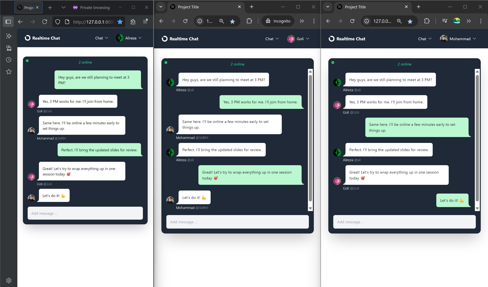
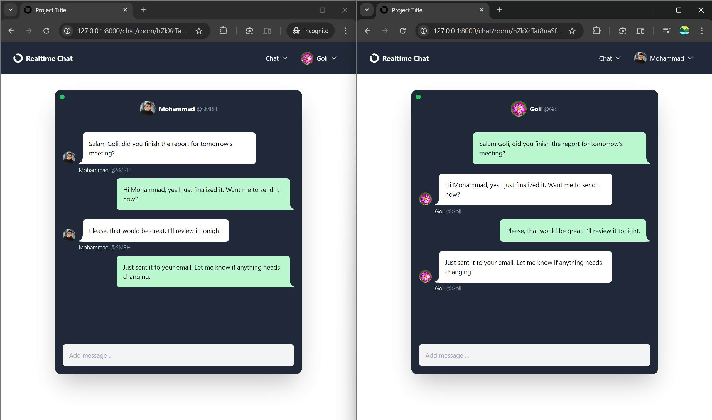

# Real-Time Chat App (Django Channels + WebSockets + HTMX)

This project is a **real-time chat application** built using Django, Django Channels, WebSockets, Redis, and HTMX.
It enables seamless, bidirectional communication between users with live message broadcasting, active user tracking (user presence detection), with full support for group communication, asynchronous communication and dynamic frontend updates — all without the need for JavaScript.


## ✨ Features

* **Real-Time Messaging**: Instantly broadcast messages between users without page refresh.
* **WebSocket Integration**: Persistent, bidirectional communication using Django Channels.
* **Asynchronous Communication**: Built on ASGI for handling multiple requests simultaneously without blocking.
* **User Presence**: Automatically shows when users join or leave a chat room and updates the online user count in real time.
* **Group Messaging**: Messages are broadcast to all users in the same chat room.
* **Redis Integration**: Used as a channel layer backend for efficient pub/sub message distribution.
* **Frontend with HTMX**:

  * Live message updates without page reloads.
  * Seamless UI interactions with zero JavaScript.
* **Scalable Architecture**: Ready for production deployment with ASGI servers like Daphne or Uvicorn.


## 🧰 Technologies and Libraries Used

* **Python**: Core programming language.
* **Django**: Backend web framework.
* **Django Channels**: Enables asynchronous WebSocket support in Django.
* **Redis**: High-performance in-memory store used for managing message channels.
* **HTMX**: Frontend enhancement tool that enables dynamic updates via HTML over HTTP.
* **ASGI**: Asynchronous Server Gateway Interface, replacing traditional WSGI.
* **Daphne/Uvicorn**: ASGI servers used to serve the application.


## ⚙️ How It Works

1. **Initial Page Load**:

   * The user accesses a Django-rendered chat page over HTTP.

2. **WebSocket Upgrade**:

   * Once loaded, the page initiates a WebSocket connection via Django Channels.
   * A handshake upgrades the HTTP request to a persistent WebSocket connection.

3. **Chat Communication**:

   * Messages sent by one user are received and broadcast to all other users in the same room using a Redis-powered channel layer.
   * The chat remains responsive and asynchronous throughout the session.

4. **User Tracking**:

   * The server keeps track of which users are online and in which chat room.
   * When users join or leave, messages and presence indicators update automatically.

5. **HTMX Frontend**:

   * HTMX is used for UI enhancements without writing any JavaScript.
   * Forms and user presence updates are dynamically rendered.


## 🚀 Setup and Usage

### Prerequisites

* Python 3.8+
* Redis server
* Virtual environment tool (e.g., `venv`, `pipenv`)

### Installation

1. **Clone the Repository**

   ```bash
   git clone https://github.com/SMR-H/realtime-websocket-chat.git
   cd realtime-websocket-chat
   ```

2. **Set Up Virtual Environment**

   ```bash
   python -m venv venv
   source venv/bin/activate  # On Windows: venv\Scripts\activate
   ```

3. **Install Dependencies**

   ```bash
   pip install -r requirements.txt
   ```

4. **Start Redis Server**

   ```bash
   redis-server
   ```

5. **Run Migrations**

   ```bash
   python manage.py migrate
   ```

6. **Run the ASGI Server**

   ```bash
   daphne core.asgi:application
   ```

7. **Open in Browser**

   ```
   http://localhost:8000
   ```


## 🗂️ Project Structure

```
realtime-websocket-chat/
├── chat/
│   ├── consumers.py       # WebSocket event handlers
│   ├── routing.py         # WebSocket routes
│   ├── templates/         # HTMX-enhanced frontend
│   └── views.py
├── core/
│   ├── asgi.py            # ASGI application entry point
│   ├── settings.py
├── manage.py
└── requirements.txt
```

## 📸 Screenshots

### Public Group Chat (3 Users)


### Private Chat (2 Users)


## 💡 Example Use Case

* **Messaging Platform**: Great for internal communication tools, customer support systems, or educational live chatrooms.


## ⚡ HTMX Integration

HTMX allows partial HTML updates from the server without full page reloads. In this chat app, HTMX is used to:

* Load chat message blocks asynchronously.
* Show dynamic user join/leave status.
* Replace forms and update message lists with no JavaScript required.

HTMX is fully backend-driven and plays nicely with Django templates, making it beginner-friendly and powerful.


## 🏁 Production Tips

* Use **PostgreSQL** instead of SQLite for production.
* Use **Daphne** or **Uvicorn** with a process manager like **Supervisor** or **Gunicorn** (with ASGI support).
* Deploy **Redis** in a secure, persistent environment.
* Consider **Nginx** as a reverse proxy and TLS termination point.


## 📄 License

This project is licensed under the **MIT License**. See the [LICENSE](LICENSE) file for details.
